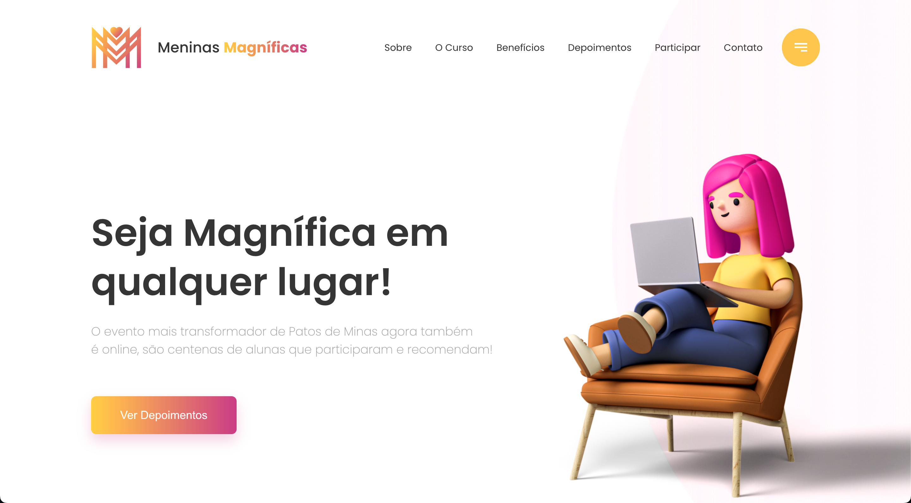

# Meninas Magníficas

Projeto realizado para captação de leds para o curso meninas magníficas.

## Tipo de Projeto

- One Page Responsiva

## Feito Com:

### Support Ou Contato

Copyright © 2021 Gabriel Alves

